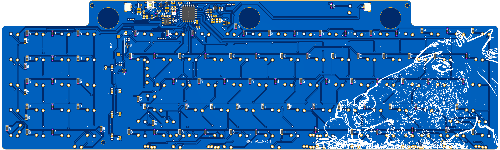
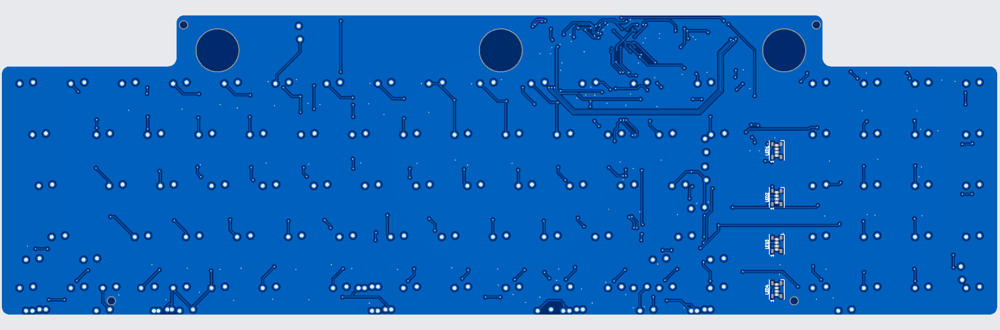

# m0116

USB/QMK STM32F401RETx PCB for Apple M0116 and M0118 (Alps) with multiple layout options, WS2812B addressable LED & buzzer support.  

## Released without warranty, use at your own risk.  HAS NOT BEEN TESTED OR PRINTED YET OR EVEN MEASURED THAT CAREFULLY.  THIS CONTROLLER SETUP IS EXPERIMENTAL.  Please confirm parts placement with JLC carefully.

Bottom row supports:
* AEK (1.5u 1.25u 1.5u 6.5u 1.5u 1.25u 1.5u)
* M0116 (1u 1u 1.75u 1u 4.75u 1u 1u 1u 1u 1u)
* Custom split M0116 (1u 1u 1.75u 1u 1u 1.75u 1u 1u 1u 1u 1u 1u 1u)

Numpad supports:
* The normal "grid except for 0 and enter being 2u"
* Actual grid

(Even less supported) m0330 variant here: https://github.com/djvs/m0330

PRs & feedback welcome!

---

Dimensions: 371 x 112 mm

---

Shield: [![CC BY-SA 4.0][cc-by-sa-shield]][cc-by-sa]

This work is licensed under a
[Creative Commons Attribution-ShareAlike 4.0 International License][cc-by-sa].

[![CC BY-SA 4.0][cc-by-sa-image]][cc-by-sa]

[cc-by-sa]: http://creativecommons.org/licenses/by-sa/4.0/
[cc-by-sa-image]: https://licensebuttons.net/l/by-sa/4.0/88x31.png
[cc-by-sa-shield]: https://img.shields.io/badge/License-CC%20BY--SA%204.0-lightgrey.svg
